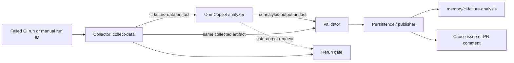

# Analyze CI failures

The [`Analyze CI Failure`](../../.github/workflows/analyze-ci-failure.md)
workflow turns a failed `CI` run into a validated classification and, when
appropriate, a durable cause record and tracking issue.

## Executive summary

- **The collector establishes what happened.** It pins the run attempt, gathers
  jobs, logs, annotations, structured test results, pull request or `main`
  context, retry patterns, and prior causes.
- **One primary Copilot analyzer explains why it happened.** It classifies every
  failed job, groups failures by mechanism, and proposes cause IDs.
- **The validator authenticates the analyzer's evidence.** It rejects invented,
  omitted, duplicated, or rebound run, job, test, and cause records before any
  persistence or publication side effect.
- **The persistence/publisher records the validated result.** It updates the
  `memory/ci-failure-analysis` branch, cause tracking issues, and pull request
  comments. A separate safe-output job may rerun eligible infrastructure
  failures when reruns are enabled; that path independently checks the trusted
  run evidence before requesting a rerun.

Generated gh-aw jobs provide activation, threat detection, safe-output
processing, and failure reporting. They are framework safety machinery, **not a
second cause-analysis agent**.

## End-to-end flow



In words:

1. `collect-data` gathers bounded evidence and uploads `ci-failure-data`.
2. The primary Copilot analyzer reads that evidence, writes
   `analysis-result.json` and per-cause JSON files, and uploads
   `ci-analysis-output`.
3. The validator compares the analyzer's output with the collected evidence.
4. The persistence/publisher stores validated runs and causes, then creates or
   updates issues and pull request comments.
5. If the analyzer requests a rerun, a separate deterministic gate rechecks the
   trusted data and current run or pull request state before acting.

## Triggers

### Automatic

The `workflow_run` trigger listens for completed `CI` workflows on `main`.
`collect-data` proceeds only when:

- The repository owner is `microsoft`.
- The `CI` run concluded with `failure`.
- The failed run attempt is 1, 2, or 3.

The event's run ID and run attempt are pinned. A later retry of the same run
does not change the attempt being analyzed.

### Manual

`workflow_dispatch` accepts a numeric `run_id`. Manual collection:

- Loads the latest attempt of that run.
- Requires the run to belong to `.github/workflows/ci.yml`.
- Accepts a `main` push or a `pull_request`/`pull_request_target` run.
- Skips successful runs, unsupported scopes, and runs with no diagnostic failed
  jobs.

The manual path is how a pull request run can currently be analyzed; automatic
analysis is limited to failed `main` runs.

## Components and responsibilities

| Component | Determines | Only verifies or preserves |
| --- | --- | --- |
| **Collector** (`collect-data`) | Run scope, pinned attempt, failed numeric job IDs, unambiguous subject PR, structured test observations, and whether `main` candidate history is complete | It does not decide the failure category or cause mechanism |
| **Analyzer** (one Copilot `agent` job) | Job and test classifications, overall verdict, mechanism grouping, proposed cause IDs, and whether to request a rerun | It cannot authorize side effects or redefine collected run, job, test, or PR identity |
| **Validator** (`analyze-ci-failure-validation.sh`) | Whether analyzer output is safe and consistent enough to publish | It does not decide whether two diagnostics are the same long-lived cause and does not map one proposed cause ID to another |
| **Persistence/publisher** (`publish_data`) | How validated data is merged, replayed, rendered, and linked to issues or PR comments | It preserves stored cause identity and diagnostics; it does not redo semantic cause analysis |

The authored safe-output job is named `publish-data`. gh-aw compiles it to the
`publish_data` job in
[`analyze-ci-failure.lock.yml`](../../.github/workflows/analyze-ci-failure.lock.yml).

## Data passed between stages

### `ci-failure-data`

The collector uploads the `ci-failure-data/` directory as the
`ci-failure-data` GitHub Actions artifact. Important files include:

| File | Purpose |
| --- | --- |
| `run.json` | GitHub's metadata for the selected run attempt |
| `run-context.json` | Trusted run ID, attempt, scope, SHA, branch, and subject PR number |
| `all-jobs.json`, `failed-jobs.json` | Attempt-scoped jobs and the diagnostic failed-job subset |
| `job-<job-id>.log` | Sanitized, bounded, error-focused job log |
| `annotations-<job-id>.json` | Check-run annotations for a failed job |
| `test-evidence.json` | Whether structured test evidence is `complete`, `not-applicable`, or `unavailable` |
| `test-failures.json` | Sanitized structured TRX or Mocha failures, when evidence is complete |
| `pr-metadata.json`, `pr-files.json` | Pull request context, when one subject PR is known |
| `last-successful-main-run.json` | Nearest earlier successful `main` run |
| `candidate-merges.json`, `candidate-merge-history-status.json` | Candidate merge range and its completeness state |
| `triggering-merge-pr.json` | The merge associated with the failed `main` SHA; context only |
| `retry-patterns.json` | Known transient patterns copied from [`eng/test-retry-patterns.json`](../../eng/test-retry-patterns.json) |
| `prior-causes/*.json` | Existing causes copied from `memory/ci-failure-analysis` |
| `analysis-summary.md` | Bounded, inert rendering of the collected evidence for the analyzer |

The collector selects structured test-result artifacts within the pinned run
and attempt, downloads each by artifact ID, and binds the parsed results to the
producing job name. Required TRX evidence fails closed when it is missing,
ambiguous, oversized, or malformed. VS Code extension Mocha diagnostics are
optional because setup may fail before the reporter writes them.

GitHub's artifact API does not identify the producer job. Selection therefore
depends on the artifact and job naming contracts in
[`run-tests.yml`](../../.github/workflows/run-tests.yml) and
[`extension-e2e-tests.yml`](../../.github/workflows/extension-e2e-tests.yml).

### `ci-analysis-output`

The analyzer writes:

- `/tmp/gh-aw/agent/analysis-result.json` — one run-level classification.
- `/tmp/gh-aw/agent/causes/<proposed-cause-id>.json` — one file per proposed
  recurring mechanism, up to ten.

The post-step uploads those files as the `ci-analysis-output` artifact. The
validator and persistence/publisher download both `ci-analysis-output` and
`ci-failure-data`; they do not trust an analyzer file in isolation.

The analyzer also emits gh-aw safe-output requests for `publish_data` and,
when eligible, `rerun_failed_jobs`. Those requests select generated jobs; they
do not bypass validation inside the jobs.

## Identity model

These identities answer different questions:

| Term | Definition |
| --- | --- |
| **Run attempt** | One execution of a workflow run. `(run_id, run_attempt)` distinguishes retries of the same run. |
| **Numeric job ID** | GitHub's numeric ID for one job in one run attempt. It binds evidence to the exact job, even when job names repeat. |
| **Test observation** | One exact `{test name, numeric job ID}` pair extracted from a trusted structured result artifact for the current attempt. |
| **Occurrence** | Evidence that one cause mechanism appeared in one run attempt. It stores run ID, attempt, validated run or attempt URL, observation time, PR context, jobs, and verified tests when available. |
| **Cause mechanism** | The long-lived underlying reason for failures, such as a browser debugger timeout or a NuGet feed timeout. |
| **Proposed cause ID** | The lowercase, hyphenated ID and filename selected by the analyzer for the current result. |
| **Cause ID** | The ID of the persisted cause mechanism in `memory/ci-failure-analysis/causes/`. |
| **Tracking issue** | The GitHub issue linked from a persisted cause and identified by publisher-owned cause and type markers. |

The core relationship is:

```text
run → attempt → numeric jobs → current test observations
cause mechanism → occurrences across attempts → zero or more test observations
cause ID → one persisted cause record → zero or one linked tracking issue
```

Numeric job IDs and test observations authenticate **current evidence**. They
do not identify a long-lived cause:

- One cause can affect several tests, jobs, runs, and pull requests.
- One test can fail for several unrelated causes.
- Job and test names must not be used as durable cause identity.

Structured results are initially stamped with the producing job name. The
validator requires that name to resolve to exactly one trusted numeric job ID;
per-cause test observations use that numeric ID.

## Analysis and cause matching

The analyzer classifies each failed job from its current failed phase and
diagnostic before considering prior causes. A failed setup or download step is
not a flaky test merely because it occurred in a test job.

The supported per-job classifications are:

- `transient-infra`
- `flaky-test`
- `code-issue` for pull request scope
- `main-repository-breakage` for `main` scope

The run-level verdict uses the applicable classifications above and can also be
`mixed` when transient and non-transient failures occur together.

Known patterns from `eng/test-retry-patterns.json` are analyzer evidence. They
contain literal or regular-expression output patterns and human-readable
reasons; they do not override the current failed phase.

### Current cause-ID behavior

Cause matching is currently a **semantic analyzer decision**. The analyzer
compares the current failure category, phase, diagnostic, and relevant prior
cause data. If it decides that a prior cause matches, it must reuse that cause
ID as its proposed cause ID.

The validator then checks that:

- The ID is a valid slug and matches the cause filename.
- The cause is referenced by the run summary.
- A prior cause with that same ID does not change type.
- The cause references compatible trusted jobs and, for flaky tests, exact
  trusted test observations.

The validator does **not** search all prior causes and map the proposed cause ID
to a different canonical ID. A newly proposed valid ID is persisted as a new
cause ID.

> **Known limitation — [#19578](https://github.com/microsoft/aspire/issues/19578):**
> cause reuse depends on the analyzer considering the relevant prior cause.
> Deterministic canonical cause resolution is not currently implemented, so
> prior-cause context that the analyzer does not consider can produce a
> duplicate cause.

## Validator trust boundary

[`analyze-ci-failure-validation.sh`](../../.github/workflows/analyze-ci-failure-validation.sh)
runs before publication. It sanitizes analyzer output and compares it with the
collected artifact.

It verifies:

- Run ID, run scope, run URL, and subject PR constraints.
- Exact coverage of every trusted numeric failed-job ID.
- Allowed verdicts, job classifications, and cause types for the run scope.
- Exact coverage of every trusted `{test name, job name}` record when
  structured test evidence is complete.
- Unique ownership of each flaky test observation by exactly one cause.
- Cause-to-job compatibility, cause-file limits, schemas, field bounds, and
  stored type compatibility.

It replaces analyzer-supplied test diagnostics with the bounded values from
trusted structured artifacts before publication.

It does not verify that a proposed cause ID is the best semantic match for an
existing mechanism. It also does not make incomplete `main` history
attributable.

## Persistence and publication

After validation, `publish_data`:

1. Rebuilds the persisted run summary from trusted run, job, PR, and `main`
   context plus the validated semantic classifications.
2. Adds an occurrence to each proposed cause.
3. Merges by exact cause ID while preserving stored cause title, type,
   diagnostic pattern, legacy fields, and issue link.
4. Pushes the validated run and cause records to
   `memory/ci-failure-analysis`.
5. Creates, reopens, or updates the matching cause issue.
6. Stores issue links or publication-refresh state back on the memory branch.
7. Creates or updates the marked analysis comment for an actionable subject
   pull request.

Pull request `code-issue` results are comment-only and are not persisted as
recurring causes. `main` analyses are reported through cause issues, not pull
request comments.

Issue matching uses the stored repository issue URL when valid, then
falls back to publisher-owned cause and type markers across open and closed
issues. Human operator notes are preserved. Unsupported legacy issue-body
shapes are left intact when they cannot be migrated safely.

For `[Main CI Failure]` issues, the persistence/publisher derives the public
title and diagnostic details from collected run and SHA context. Analyzer
titles and patterns remain matching metadata, not published attribution.

PR comments and reruns recheck that the subject PR is still open and unlocked
immediately before mutation. A validated transient `main` run does not require
a subject PR. Shared persistence and issue publication are serialized across
analyzed runs.

## Pull request attribution

For pull request scope, PR-directed effects require exactly one subject PR. The
collector tries, in order:

1. The run's pull request association.
2. Pull requests associated with the exact head SHA.
3. A fork owner and branch lookup whose candidate must still match the exact
   failed head SHA.

Missing or ambiguous results do not produce a guessed subject. Run-scoped cause
persistence can continue, but PR context is recorded as unavailable and no PR
comment or PR-gated rerun is attempted.

## `main` attribution

For a failed `main` run, the merge associated with the failed SHA is only
trigger context. It is not presumed causal.

[`analyze-ci-failure-history.sh`](../../.github/workflows/analyze-ci-failure-history.sh)
finds the nearest earlier successful `main` run. Then
[`analyze-ci-failure-candidates.sh`](../../.github/workflows/analyze-ci-failure-candidates.sh)
compares that SHA with the failed SHA and maps every returned commit to exactly
one PR merged into `main`.

The candidate range is attributable only when:

- GitHub reports the comparison as `ahead`.
- Every comparison commit is returned.
- Every commit maps to exactly one merged PR targeting this repository's
  `main` branch.

Identical, behind, diverged, malformed, unavailable, or incomplete comparisons
remain non-attributable. The analyzer may still report repository-level
breakage, but it must not name a candidate PR as causal without direct evidence
and complete history.

## Replay and immutable occurrence evidence

An occurrence is keyed by `(run_id, run_attempt)`.

Once a stored occurrence has an explicit attempt, replaying that same attempt
does not rewrite its observation time, PR context, jobs, or tests. Its managed
links identify the exact attempt with `/attempts/<number>`, including attempt
1, so a later retry cannot change the result shown by a historical row. Issue
publication renders from stored evidence rather than mutable analyzer output.
This makes recovery from a partial publication failure repeatable.

The persistence helper's `publication-occurrence` command selects the current
trusted occurrence for the issue summary and refresh decision. After cause
merging, `backfill-occurrence-publication` stores the bounded job/test table,
issue context, and run scope needed to reproduce that occurrence's managed
table row. Backfilling happens after merging because legacy enrichment may
preserve an older observation date or job label.

Legacy occurrences without `run_attempt` have an unknown attempt and retain
their run-only URL. When the current trusted run proves that such a record is
attempt 1, persistence may enrich it while preserving its original observation
time and historical display metadata. Older records that already say
`run_attempt: 1` but use the former run-only URL remain readable; their managed
projection uses the exact `/attempts/1` link.

Verified job IDs and tests remain separate validation evidence. Backfill records
when the historical job label remains authoritative so issue recreation uses
the same display after the first successful publication.

Stored occurrences are ordered by `observed_at`, with `occurred_at` accepted as
a legacy alias. Memory is authoritative for the complete managed occurrence
history, including each row's date, run link, job/test labels, and context. The
issue body is a projection and is never read back into trusted memory.
Historical rows with neither stored PR context nor run scope render the context
as `unavailable`. A matching trusted `runs/<run-id>.json` summary may recover a
missing historical `main` scope; malformed, mismatched, or pull-request
summaries do not. Authenticated `main` scope always renders as `main`, even when
legacy metadata contains a positive PR number or cached `#N` context. Editable
issue text is never trusted to recover missing data.

The issue renderer:

- Uses `stored-occurrence-rows` to rebuild every managed row from persisted
  occurrence evidence. Older records use a deterministic fallback from
  persisted occurrence and cause fields; current analyzer output and editable
  issue content are never fallback sources.
- Parses the existing managed section only to preserve operator-authored text
  before and after it.
- Does not treat a matching run link in operator notes as a published row.
- Replaces stale, missing, duplicate, untracked, or malformed-looking issue
  rows with the canonical stored projection.
- Fails closed when unsupported operator text appears inside the managed
  section, where replacing it could silently delete human-authored content.
- Keeps the newest rows that fit the issue-body budget.
- Requires stored run ID, attempt, and current-repository Actions URL to
  identify the same run attempt. Explicit attempts use
  `/attempts/<number>` for every positive attempt. A record with no attempt
  remains a run-only legacy record.
- Emits only exact four-column occurrence rows. Literal pipes in generated job
  and test labels are escaped. PR context must be a positive canonical `#N`;
  `#0`, leading-zero forms, and invalid stored rows fail closed.
- Shows at most 20 jobs and 20 tests, truncates each displayed name to 120
  Unicode code points, and adds remaining-count markers.
- Filters tests to the visible jobs before applying the test display cap.
- Can recreate a deleted issue or restore previously budget-trimmed rows from
  complete occurrence evidence retained in memory.

Historical labels without numeric job IDs remain descriptive evidence. Replay
does not invent modern job or test identity for them.

Older scalar `test_name` fields remain accepted for compatibility only when the
current name is verified in every referenced job. Grouped labels, job names,
and missing names in historical records are not promoted to verified test
identity or split into new causes.

## Side-effect gates

- Publication requires successful gh-aw threat detection, safe-output
  processing, and the analysis validation step.
- Reruns require a validated pure `transient-infra` result, available structured
  test-evidence state, exact failed-job coverage, no reported failed tests, and
  a run that has not advanced beyond the pinned attempt.
- `ENABLE_RERUN` is currently `false`, so rerun requests operate in dry-run
  mode.
- Cause and issue bodies, logs, annotations, test evidence, artifact counts,
  and analyzer cause files have explicit bounds.
- Failed custom jobs intentionally retain gh-aw's
  `[aw] Failed jobs: Analyze CI Failure` alert because validation or publication
  can fail before any cause issue or PR comment exists.

## Implementation and validation

The authored agentic workflow is
[`analyze-ci-failure.md`](../../.github/workflows/analyze-ci-failure.md). gh-aw
compiles it into the generated
[`analyze-ci-failure.lock.yml`](../../.github/workflows/analyze-ci-failure.lock.yml).
The compiled workflow contains one primary `agent` job plus generated
activation, detection, safe-output, conclusion, and failure-reporting jobs.

Collection, history, candidate selection, validation, persistence, comment
rendering, and issue rendering helpers live beside the workflow as
`analyze-ci-failure-*.sh`.

Focused coverage lives in
[`AnalyzeCiFailureWorkflowTests`](../../tests/Infrastructure.Tests/WorkflowScripts/AnalyzeCiFailureWorkflowTests.cs).
When changing the workflow, helpers, job or artifact naming contracts, or this
document, keep the authored workflow, generated lock, scripts, and tests
aligned.

```bash
dotnet test --project tests/Infrastructure.Tests/Infrastructure.Tests.csproj \
  --no-launch-profile -- \
  --filter-class "*.AnalyzeCiFailureWorkflowTests" \
  --filter-not-trait "quarantined=true" \
  --filter-not-trait "outerloop=true"

gh aw compile analyze-ci-failure --validate --actionlint --shellcheck
```
