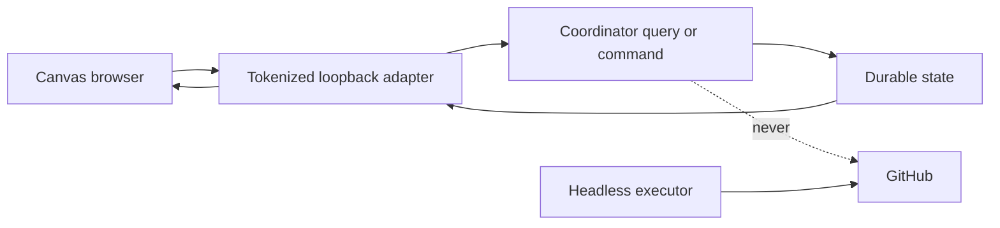

# CI Shepherd Canvas Control Surface Implementation Plan

> **For agentic workers:** REQUIRED SUB-SKILL: Use superpowers:subagent-driven-development (recommended) or superpowers:executing-plans to implement this plan task-by-task. Steps use checkbox (`- [ ]`) syntax for tracking.

**Goal:** Add the approved report-first Canvas for observing CI Shepherd runs, editing non-authorizing policy drafts, activating/revising/pausing/revoking policy, and making exact action decisions without becoming part of execution.

**Architecture:** Build an isolated Canvas extension whose loopback adapter shells out to the headless `coordinator.py` JSON interface from the autonomous-policy plan. The browser receives read-only projections plus revision-bound commands; it never reads credentials, constructs grants, rewrites frozen actions, or calls GitHub. Draft UI state is durable but non-authorizing, while every active policy or exact decision is appended by the coordinator.

**Tech Stack:** Node.js ESM, built-in `node:http`, built-in `node:test`, HTML/CSS/JavaScript, Copilot Canvas SDK, Python coordinator CLI, Playwright browser automation supplied by the development environment.

---

## Quick read

- **Primary product:** headless CI Shepherd keeps running with no Canvas process.
- **Canvas role:** show the compact run summary, flow, policy exposure, exact
  actions, investigations, and durable outcomes.
- **Writable controls:** save a draft; activate/revise/pause/revoke policy; or
  approve/reject/clear one frozen action before intent.
- **Trust boundary:** the browser sends a decision and state revision, never an
  authoritative target, operation, body, budget, or success result.
- **Reconnect:** a new Canvas instance reloads coordinator state and the separate
  non-authorizing draft.
- **Validation:** Node component/server tests, real-browser interaction at three
  widths, headless/Canvas artifact equivalence, then a fresh safety review.



## Prerequisite

Complete and validate `docs/superpowers/plans/2026-09-03-ci-shepherd-autonomous-policy.md` first. The Canvas must consume the coordinator interface as shipped; do not duplicate policy logic in JavaScript.

## Scope and file structure

**Create:**

- `.github/extensions/ci-shepherd-control/copilot-extension.json` — Canvas registration manifest.
- `.github/extensions/ci-shepherd-control/extension.mjs` — SDK registration and instance lifecycle only.
- `.github/extensions/ci-shepherd-control/coordinator-client.mjs` — bounded subprocess calls to `coordinator.py`.
- `.github/extensions/ci-shepherd-control/drafts.mjs` — serialized, durable, non-authorizing draft storage.
- `.github/extensions/ci-shepherd-control/model.mjs` — projection-to-view-model transformation and exposure math display.
- `.github/extensions/ci-shepherd-control/render.mjs` — layout A HTML, styles, and browser behavior.
- `.github/extensions/ci-shepherd-control/server.mjs` — per-instance tokenized loopback HTTP/SSE adapter.
- `.github/extensions/ci-shepherd-control/coordinator-client.test.mjs`
- `.github/extensions/ci-shepherd-control/drafts.test.mjs`
- `.github/extensions/ci-shepherd-control/model.test.mjs`
- `.github/extensions/ci-shepherd-control/render.test.mjs`
- `.github/extensions/ci-shepherd-control/server.test.mjs`
- `.github/extensions/ci-shepherd-control/README.md`

**Modify:**

- `.github/extensions/validate-extensions.mjs` only if validation reveals a general extension-host gap; do not special-case the new extension.
- `.github/extensions/validate-extensions.test.mjs` only with a matching validator change.

The extension stores no GitHub token and imports no GitHub client.

### Task 1: Register an isolated Canvas extension

**Files:**

- Create: `.github/extensions/ci-shepherd-control/copilot-extension.json`
- Create: `.github/extensions/ci-shepherd-control/extension.mjs`

- [ ] **Step 1: Create the strict manifest**

Use:

```json
{
  "name": "ci-shepherd-control",
  "version": 1
}
```

- [ ] **Step 2: Add the Canvas entrypoint**

Register `id: "ci-shepherd-control"` with `displayName: "CI Shepherd"`. The `open`
handler must call `startInstance` with `ctx.instanceId` and the session logger,
then return its URL. `onClose` must stop only that instance. Expose actions:

```text
refresh
summary
activate_policy
pause_policy
revoke_policy
set_exact_decision
clear_exact_decision
```

Every mutating action schema requires `expectedRevision`. The handlers call server/coordinator functions and translate typed coordinator errors to `CanvasError` without changing their code.

- [ ] **Step 3: Run syntax validation and observe missing imports**

```bash
node .github/extensions/validate-extensions.mjs
```

Expected: syntax validation succeeds. The validator deliberately does not import
SDK entrypoints, so missing support modules are detected by Task 2's Node tests,
not by this command.

- [ ] **Step 4: Show and create the checkpoint commit after Task 2 makes imports valid**

Proposed commit:

```text
feat(ci): register shepherd control Canvas
```

Do not commit the broken entrypoint alone; commit it with Task 2.

### Task 2: Add a bounded coordinator subprocess client

**Files:**

- Create: `.github/extensions/ci-shepherd-control/coordinator-client.mjs`
- Create: `.github/extensions/ci-shepherd-control/coordinator-client.test.mjs`

- [ ] **Step 1: Write failing client tests**

Inject `execFile` into the client and test:

- executable is `python3`;
- script path resolves to `.ci-shepherd-build/scripts/coordinator.py`;
- `PYTHONPATH` prepends `.ci-shepherd-build/scripts` without dropping the caller's existing value;
- argument arrays are passed directly, never through a shell;
- 30-second timeout and 1 MiB output bound are enforced;
- valid stdout must be one JSON object;
- nonzero typed JSON errors preserve `code` and refreshed `projection`;
- malformed/oversized output and timeout are explicit failures;
- repository/state/proposal paths are supplied by trusted extension configuration, not browser input.

Use:

```javascript
const client = createCoordinatorClient({
  repositoryRoot,
  stateDirectory,
  execFile: recordingExecFile,
});

const projection = await client.projection({
  repository: "microsoft/aspire",
  proposalsPath,
  runId,
});
assert.equal(projection.repository, "microsoft/aspire");
```

- [ ] **Step 2: Run the test and verify the missing module failure**

```bash
node --test .github/extensions/ci-shepherd-control/coordinator-client.test.mjs
```

Expected: missing `coordinator-client.mjs`.

- [ ] **Step 3: Implement only typed coordinator commands**

Export `createCoordinatorClient(options)`. Its returned object has four async
methods with these exact interfaces:

```text
projection(input) -> coordinator projection
activatePolicy(input) -> appended policy event plus refreshed projection
pausePolicy(input) -> appended paused revision plus refreshed projection
revokePolicy(input) -> appended revoked revision plus refreshed projection
previewPolicy(input) -> validated reachability/exposure without persistence
setDecision(input) -> appended exact-decision event plus refreshed projection
clearDecision(input) -> appended clear event plus refreshed projection
```

Use `execFile`/`promisify`, static imports, argument arrays, and no shell. Resolve active run/proposal paths server-side from the coordinator projection or a configured owner-only state root. Reject paths outside the CI Shepherd state/run roots. The trusted extension/session adapter supplies actor identity; never accept it from browser JSON.

- [ ] **Step 4: Run client and extension validation**

```bash
node --test .github/extensions/ci-shepherd-control/coordinator-client.test.mjs
node .github/extensions/validate-extensions.mjs
```

Expected: client tests pass and the new extension imports safely.

- [ ] **Step 5: Show and create the checkpoint commit**

Proposed commit:

```text
feat(ci): connect Canvas to shepherd coordinator
```

Stage the manifest, entrypoint, client, and client test only.

### Task 3: Persist non-authorizing drafts separately

**Files:**

- Create: `.github/extensions/ci-shepherd-control/drafts.mjs`
- Create: `.github/extensions/ci-shepherd-control/drafts.test.mjs`

- [ ] **Step 1: Write failing draft tests**

With a temporary `COPILOT_HOME`, assert:

- drafts are keyed by repository, not `instanceId`;
- default draft uses approved caps and a 30-day expiry;
- updates are serialized so concurrent changes do not overwrite one another;
- malformed draft JSON returns an explicit read-only error, not default authorized state;
- drafts contain no grant, token, active-policy flag, or exact decision;
- reopening under a new instance restores the same draft;
- draft revision is independent from coordinator `stateRevision`.

- [ ] **Step 2: Run tests and verify missing module**

```bash
node --test .github/extensions/ci-shepherd-control/drafts.test.mjs
```

Expected: missing `drafts.mjs`.

- [ ] **Step 3: Implement serialized atomic draft storage**

Persist:

```text
$COPILOT_HOME/extensions/ci-shepherd-control/artifacts/drafts.json
```

Shape:

```json
{
  "schemaVersion": 1,
  "draftRevision": 3,
  "repositories": {
    "microsoft/aspire": {
      "operationClasses": {},
      "expiresInDays": 30,
      "updatedAtUtc": "2026-09-03T16:00:00Z"
    }
  }
}
```

Use write-to-temporary plus rename, owner-only permissions where supported, and a module-level promise chain for same-process serialization. Validate all caps against the UI limits, but treat coordinator validation as authoritative on activation.

- [ ] **Step 4: Run draft tests**

Run the Step 2 command.

Expected: all tests pass.

- [ ] **Step 5: Show and create the checkpoint commit**

Proposed commit:

```text
feat(ci): preserve Canvas policy drafts
```

### Task 4: Build the report-first view model

**Files:**

- Create: `.github/extensions/ci-shepherd-control/model.mjs`
- Create: `.github/extensions/ci-shepherd-control/model.test.mjs`

- [ ] **Step 1: Write failing projection tests**

Feed a complete coordinator projection and assert the model contains, in this order:

1. run health/completeness/proposal count/exposure;
2. operation toggles and caps;
3. ranked actions with exact decision controls;
4. expandable body/evidence/expected result/blockers;
5. investigation running/queued/completed/blocked counts;
6. activate/pause/revoke/refresh controls.

Also test:

- exact rejection status visually overrides broad allow;
- exact approval is labeled one-time and does not change a class toggle;
- maximum exposure comes from coordinator output, never browser arithmetic;
- draft maximum exposure comes from `policy-preview`, not the active-policy
  projection and not browser arithmetic;
- zero-candidate enabled class has a warning;
- blocked-only enabled class has a warning;
- stale/expired/revoked/unavailable states have distinct banners;
- frozen body is returned as display-only text;
- unsupported operation classes cannot be toggled into existence.

- [ ] **Step 2: Run and verify missing module**

```bash
node --test .github/extensions/ci-shepherd-control/model.test.mjs
```

Expected: missing `model.mjs`.

- [ ] **Step 3: Implement pure transformation functions**

Export:

```javascript
export function buildViewModel({ projection, draft, coordinatorAvailable }) {}
export function policyWarnings({ projection, draft }) {}
```

The module performs no I/O. It uses coordinator-provided budget/exposure values and only formats labels/counts.

- [ ] **Step 4: Run model tests**

Run the Step 2 command.

Expected: all tests pass.

- [ ] **Step 5: Show and create the checkpoint commit**

Proposed commit:

```text
feat(ci): project shepherd policy status
```

### Task 5: Render layout A with safe commands

**Files:**

- Create: `.github/extensions/ci-shepherd-control/render.mjs`
- Create: `.github/extensions/ci-shepherd-control/render.test.mjs`

- [ ] **Step 1: Write failing render/interaction tests**

Use the existing `render.test.mjs` pattern and a minimal DOM harness. Assert:

- landmark and heading order matches layout A;
- all controls have accessible names;
- 480px, 720px, and 1024px widths do not hide policy/exposure/action controls;
- body/evidence expansion is keyboard accessible;
- changing a toggle/cap saves only a draft;
- Activate sends the complete draft plus `expectedRevision`;
- Reject sends action ID, proposal binding, and revision;
- Clear is disabled after an intent;
- stale-view replaces the projection and keeps the draft separate;
- HTML escaping prevents proposal body/evidence injection;
- coordinator unavailable disables mutations and keeps report browsing available.

- [ ] **Step 2: Run and verify missing renderer**

```bash
node --test .github/extensions/ci-shepherd-control/render.test.mjs
```

Expected: missing `render.mjs`.

- [ ] **Step 3: Implement static HTML/CSS/browser JS**

Export `HTML`, `STYLES`, and `APP_JS` as in `aspire-team-app/render.mjs`. Use a compact summary strip and Mermaid-derived flow labels:

```text
Collect → Assess → Investigate (max 3) → Propose → Apply policy →
Rank → Freeze one → Exact grant → Execute → Reconcile → Report
```

Do not embed a Mermaid runtime dependency. Render the flow with semantic HTML/CSS so it works offline.

Every POST includes the last coordinator `stateRevision`. The browser never sends target, operation, or body as an authority; it sends only action ID/decision/revision, and the server/coordinator re-resolve the frozen proposal.

- [ ] **Step 4: Run render tests**

Run the Step 2 command.

Expected: all tests pass.

- [ ] **Step 5: Show and create the checkpoint commit**

Proposed commit:

```text
feat(ci): render report-first shepherd Canvas
```

### Task 6: Add a tokenized loopback server and reconnect

**Files:**

- Create: `.github/extensions/ci-shepherd-control/server.mjs`
- Create: `.github/extensions/ci-shepherd-control/server.test.mjs`
- Modify: `.github/extensions/ci-shepherd-control/extension.mjs`

- [ ] **Step 1: Write failing HTTP/security tests**

Adapt, do not copy blindly, the proven Aspire Team App guards. Cover:

- bind only `127.0.0.1` on an ephemeral port;
- generate an unguessable per-instance token and require it for every request;
- pin Host to loopback plus the exact listener port;
- reject cross-site Origin/Sec-Fetch-Site and DNS-rebinding requests for GET/SSE/POST;
- enforce small JSON body limits and allowed content type;
- one instance close ends only its SSE clients/server;
- a second instance remains alive;
- reopening under a different `instanceId` reconstructs projection/draft from durable state;
- commands verify the current repository and expected revision;
- stale-view returns HTTP 409 plus refreshed projection;
- unavailable coordinator returns HTTP 503 read-only state;
- no route accepts arbitrary command names or filesystem paths.

- [ ] **Step 2: Run server tests and verify missing server**

```bash
node --test .github/extensions/ci-shepherd-control/server.test.mjs
```

Expected: missing `server.mjs`.

- [ ] **Step 3: Implement routes**

Required routes:

```text
GET  /
GET  /api/state
GET  /events
POST /api/refresh
POST /api/draft
POST /api/policy/preview
POST /api/policy/activate
POST /api/policy/pause
POST /api/policy/revoke
POST /api/action/decision
POST /api/action/decision/clear
```

All active-policy and decision POSTs delegate to the coordinator client.
`/api/policy/preview` validates the current draft through the coordinator and
does not persist it. `/api/draft` writes only `drafts.mjs`. SSE emits a semantic
revision after durable state changes; polling `/api/state` remains sufficient
when SSE reconnects.

Use per-instance records:

```javascript
const servers = new Map(); // instanceId -> { server, url, token, clients }
```

No module-global client set may let one instance close another's stream.

- [ ] **Step 4: Run server and extension tests**

```bash
node --test \
  .github/extensions/ci-shepherd-control/server.test.mjs \
  .github/extensions/ci-shepherd-control/render.test.mjs \
  .github/extensions/ci-shepherd-control/model.test.mjs
node .github/extensions/validate-extensions.mjs
```

Expected: all tests and extension validation pass.

- [ ] **Step 5: Show and create the checkpoint commit**

Proposed commit:

```text
feat(ci): secure shepherd Canvas commands
```

### Task 7: Verify Canvas/headless equivalence

**Files:**

- Modify: `.github/extensions/ci-shepherd-control/server.test.mjs`
- Modify: `.ci-shepherd-build/tests/test_coordinator.py`

- [ ] **Step 1: Add a shared fixture interaction**

Against the frozen 2026-09-03 proposals:

1. append an edit-only draft;
2. activate it through the server;
3. reject issue 19453 exactly;
4. request coordinator selection directly;
5. request Canvas projection;
6. compare selected IDs, policy revision, budgets, and exposure.

Expected selected IDs: issue 19166 and issue 19530 edits; issue 19453 has
`reject-once`; no creates. A grant minted for either selected edit remains valid
when the Canvas changes an unrelated exact decision, but becomes invalid when
its licensing policy is paused/revoked or that exact action is rejected.

- [ ] **Step 2: Add closed-Canvas completion test**

Open the server, load state, close it, append a terminal action event and completed investigation event through coordinator/test helpers, reopen with a new instance, and assert the completed action/investigation appears. No extension process state may be required.

- [ ] **Step 3: Run equivalence tests**

```bash
node --test .github/extensions/ci-shepherd-control/server.test.mjs
cd .ci-shepherd-build
PYTHONPATH=scripts python3 -m unittest tests.test_coordinator -v
```

Expected: both suites pass and compare the same durable artifacts.

- [ ] **Step 4: Show and create the checkpoint commit**

Proposed commit:

```text
test(ci): prove Canvas policy equivalence
```

### Task 8: Validate both visual states in a real browser

**Files:**

- Modify only if browser findings require fixes in `render.mjs`, `server.mjs`, or their tests.

- [ ] **Step 1: Start a fixture-backed server**

Add a test-only exported factory that injects the coordinator client and draft path, then start the real server with the frozen fixture and an in-memory coordinator recording fake. Do not add a production fixture mode or command-line bypass.

- [ ] **Step 2: Open the Canvas URL with Playwright**

Use the Playwright browser tool, not a screenshot-only inspection. Validate at 480x900, 720x900, and 1024x900:

- summary/exposure is above policy controls;
- policy controls are above action rows;
- the flow diagram is readable;
- no horizontal clipping hides cap fields or action decisions;
- action body/evidence expansion works;
- focus order reaches every interactive control.

- [ ] **Step 3: Exercise both important visual states**

Capture and inspect:

1. active edit-only policy with three reachable edits;
2. draft enabling creates and edits, showing the increased maximum exposure before activation.

The user selected layout A already; do not reopen layout choice. If two concrete styling alternatives are needed, render them side by side in the browser before selecting one.

- [ ] **Step 4: Exercise the complete command flow**

With browser automation:

1. change a cap and verify autosaved draft;
2. activate policy;
3. reject one action;
4. confirm preview updates;
5. force a stale revision and verify refresh/no lost draft;
6. close the page/server;
7. append durable completion;
8. reopen a new instance and verify reconstruction;
9. stop the coordinator fake and verify explicit read-only mode.

Expected: no browser action produces a GitHub request or child grant directly.

- [ ] **Step 5: Convert every browser-discovered defect into a test**

Before fixing a defect, add the smallest failing `node:test` assertion that reproduces it. Then repair and rerun the targeted suite.

### Task 9: Document operation and failure behavior

**Files:**

- Create: `.github/extensions/ci-shepherd-control/README.md`

- [ ] **Step 1: Document the boundary**

Include:

- the Canvas is optional and not an executor;
- the coordinator state/run roots it reads;
- policy draft versus active revision;
- exact approve/reject/clear semantics;
- cap defaults and hard ceilings;
- close/reopen behavior;
- coordinator-unavailable read-only behavior;
- the fact that `rerun-or-retry` currently has no executable proposal mapping;
- local extension validation and test commands.

- [ ] **Step 2: Document the flow diagram**

Include the same Mermaid flow from the approved design and explain that the Canvas can change policy/decisions only before intent.

- [ ] **Step 3: Show and create the checkpoint commit**

Proposed commit:

```text
docs(ci): explain shepherd Canvas controls
```

### Task 10: Full Canvas acceptance and safety review

**Files:**

- Modify only to repair discovered defects.

- [ ] **Step 1: Run every extension test**

```bash
node .github/extensions/validate-extensions.mjs
```

Expected: all manifests/modules validate and all extension test files pass.

- [ ] **Step 2: Run the complete headless suite again**

```bash
cd .ci-shepherd-build
PYTHONPATH=scripts python3 -m unittest discover -s tests -p 'test_*.py' -v
PYTHONPATH=scripts python3 -m compileall -q scripts tests
```

Expected: all tests pass and compileall is silent.

- [ ] **Step 3: Compare a complete cycle with and without Canvas**

Pin the same fixture, time, policy ledger, and action ledger. Run the headless coordinator once with no extension process. Run again with the Canvas open but idle.

Expected: byte-identical selection, grant, intent, terminal, budget, and report projections after excluding only transport-local Canvas token/port data, which must not enter coordinator artifacts.

- [ ] **Step 4: Run the browser acceptance from Task 8**

Expected: all flows succeed at all three widths, stale revisions fail closed, reconnect restores state, and coordinator outage is read-only.

- [ ] **Step 5: Commission a fresh read-only safety review**

Give the reviewer the approved design, both implementation plans, final diff, Node/Python outputs, browser captures, and headless/Canvas artifact comparison. Require explicit findings on:

- browser trust boundary;
- loopback token/origin/Host checks;
- arbitrary path/command injection;
- stale-view enforcement;
- draft/active-policy separation;
- body/target immutability;
- close/reopen durability;
- headless equivalence.

Do not use Canvas controls for a production mutation until high-confidence findings are repaired and a separate bounded pilot is approved.

## Plan self-review

**Spec coverage:** Tasks 1–3 isolate the experimental SDK, consume the typed coordinator interface, and persist non-authorizing drafts independently of `instanceId`. Tasks 4–6 implement layout A, cap/exposure visibility, exact controls, stale revisions, security, SSE/polling, reconnect, and read-only outage behavior. Tasks 7–8 prove headless equivalence and exercise the UI in a real browser. Tasks 9–10 document and independently audit the completed boundary.

**Type consistency:** Every active mutation command uses `expectedRevision`; exact decisions identify only `actionId`; policy activation sends the complete draft but the coordinator derives the active revision. `stateRevision` is coordinator authority, while `draftRevision` is local non-authorizing UI state.

**Placeholder scan:** The plan has no deferred implementation markers. Empty JavaScript method bodies are interface signatures whose required behavior is exhaustively specified by the immediately preceding tests.
