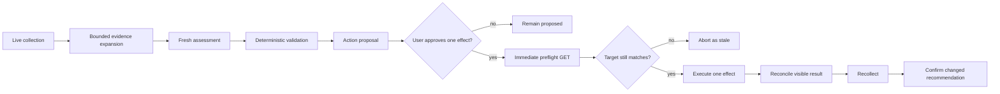

# CI Shepherd Full-Cycle POC Design

## Implementation checkpoint

The implemented state and validation evidence as of 2026-08-28 are recorded in
[CI Shepherd Implementation Status](../status/2026-08-28-ci-shepherd-implementation.md).
The agreed operational rollout is tracked in
[CI Shepherd Continuation Plan](../plans/2026-08-28-ci-shepherd-continuation.md).
Those documents supersede unchecked historical implementation steps but do not
relax this design's per-action approval boundary.

## Purpose

The CI shepherd now implements collection, incremental factual reuse, selective
fresh assessment, deterministic validation and reporting, exact-action
proposals, guarded execution, and next-run lifecycle replay.

The supported loop is:

```text
collect -> assess -> propose -> approve -> act -> reconcile -> recollect
```

The remaining objective is to learn how the cycle behaves in practice: whether the
recommendations are useful, whether the action handoffs contain enough context,
how actions appear in Copilot sessions and on GitHub issues and pull requests,
and where stale evidence, duplication, or poor UX causes friction.

This remains a staged proof rather than autonomous mutation. A daily local
Copilot workflow may start a fresh assessment agent, but effects stay behind
one exact user-approved action ID. Parallel writers, generalized retries, bulk
approval, and GitHub-hosted state are deliberately unsupported.

## Implemented Boundary

The flow records a validated immutable run:

1. Collect live issue and workflow evidence.
2. Prepare bounded issue records.
3. Append exact failure occurrences to fingerprint history.
4. Select only new, source-changed, ambiguous, or review-required cases.
5. Ask a fresh assessor for sparse typed judgments.
6. Restore deterministic defaults for omitted or silent cases.
7. Finalize, validate, render, and produce exact dry-run actions.
8. Record the immutable run and append factual lifecycle ledgers.

Assessment access is GET-only. The actor is a separate boundary: it accepts one
exact approved action ID, repeats target and assignment preflight checks,
performs only the rendered operation, and appends `executed`, `stale`, or
`failed` to private persistent action history.

## What the POC Must Prove

The full-cycle POC must demonstrate:

- A fresh live issue inventory can reach a validated report without relying on
  frozen trial artifacts.
- A report row can be converted into a bounded, auditable action proposal.
- The proposal contains enough evidence for a human to understand and approve
  the effect without reopening the entire report.
- An `investigate` judgment can launch an issue-focused Copilot session with a
  useful stop condition.
- At least one safe issue lifecycle recommendation can produce a real,
  GitHub-visible result after explicit approval.
- At least one action can produce or update a pull request after explicit
  approval, either through a quarantine command or an investigation fix.
- The next collection sees the resulting issue, pull request, or session state
  and does not propose the same action again.
- Every transition is traceable from source evidence through final outcome.
- A stale or changed target causes the action to abort rather than execute.

The POC does not need to prove that every disposition is executable.

## Approach

### Rejected: shadow-only execution

A shadow executor could produce action manifests without launching sessions or
mutating GitHub. This is useful for format iteration but does not prove that the
handoff works, that the user experience is understandable, or that results are
visible to the next run.

### Rejected: one autonomous big-bang cycle

Allowing the first executor to launch sessions, close issues, post commands, and
open pull requests in one unattended run would make failures difficult to
isolate. It would also turn current assessor variability into external effects
before the approval and reconciliation semantics are understood.

### Selected: staged live vertical slices

Run one live assessment, then exercise one action class at a time. Each
GitHub-visible effect has an individual approval gate. Each slice is reconciled
before the next slice starts.

This produces real evidence while keeping mistakes bounded and attributable.

## Interaction and Approval Contract

Every issue- or pull-request-visible effect is individually reviewed with the
user before execution. This includes:

- posting or editing a comment;
- closing or reopening an issue;
- adding or removing labels;
- assigning or unassigning a person;
- triggering a rerun or repository command;
- posting `/quarantine-test` or another bot command;
- opening or editing a pull request; and
- pushing changes intended for a pull request.

An approved `@copilot` assignment or repository bot command may create a pull
request as its direct consequence. The proposal must state that expected effect
before approval. The automatically created pull request is reconciled and shown
to the user immediately; later edits, pushes, comments, or closure are separate
effects.

Before each effect, the coordinator presents:

1. The exact issue or pull request.
2. The proposed operation.
3. The complete rendered comment, command, title, or body.
4. The cited report evidence and current preflight state.
5. The expected visible result.
6. The abort and rollback behavior.

Approval applies to one effect only. There is no first-cycle batch approval.
If the user is unavailable, the action remains `proposed` and nothing visible
is changed.

There is no automated rollback in the POC. Reversal is a new proposed effect.
Status comments describe recommendations as proposed until the corresponding
effect is observed, so a rejected or stale dependent effect does not leave a
false public claim that an action occurred.

Issue-linked Copilot session launches are also announced before creation even
though they do not mutate the GitHub issue. The user should be able to follow
the session from the app.

All automatically posted GitHub text starts with `[automated] `.
Repository commands that require the slash command to be the first bytes of a
comment cannot be posted automatically under this attribution rule. The POC
must use another approved path or show the bare command for the user to post
manually.

## Issue Communication Model

Each selected issue has one canonical CI shepherd status comment. The
coordinator creates it when the shepherd first takes responsibility for a
recommendation and edits it only when the disposition, decisive evidence, or
next step materially changes. A hidden marker identifies the comment so daily
runs do not add repeated status messages.

The marker uses the collector's existing `ci-shepherd:` marker family and
contains identity only:

```html
<!-- ci-shepherd:role=status -->
<!-- ci-shepherd:idempotency-key=issue:19166:status -->
```

It never stores disposition, confidence, evidence, or a previous judgment.

The comment contains:

- current disposition and confidence;
- the issue-specific failure identity;
- the decisive evidence in human-readable form;
- what the shepherd did or did not conclude;
- the next action or exact watch trigger; and
- links to the relevant run, canonical issue, pull request, or Copilot result.

Before Slice 1, the collector must recognize a marked status comment authored by
the authenticated coordinator identity. It retains that comment only for
idempotency detection and excludes its text, links, and markers from reference
and evidence extraction. This prevents the shepherd's own run, issue, and pull
request links from crowding out primary evidence in the next collection.

The coordinator edits a comment only when both its author matches the current
authenticated identity and the identity-only shepherd marker is present. This
is a coordinator invariant, not a GitHub permission assumption. If it cannot
identify an owned canonical comment, it proposes a new comment for user
approval instead of editing an arbitrary comment.

Action events remain separate comments when GitHub or repository automation
needs a durable event:

- a duplicate-closure explanation immediately before closure;
- a user-posted `/quarantine-test` command that creates a pull request;
- a retry or rerun explanation;
- a human-decision question; or
- a final investigation result that materially changes issue handling.

Unchanged daily observations do not produce issue writes.

### Communication by disposition

| Disposition | Issue-side behavior | Additional action |
|---|---|---|
| `watch` | Create or update the status comment with the evidence gap and exact event that ends the watch. | None. |
| `investigate` | Create or update the status comment with the bounded question, collected evidence, and requested investigation scope. | Assign the issue to Copilot after separate approval. |
| `review-quarantine` | Explain the recurrence and current quarantine state. | After separate approval, post the repository-native quarantine command. |
| `review-close` | Explain recovery or identify the canonical issue for a superseded duplicate. | After separate approval, close with the appropriate state reason. |
| `review-retry` / `review-rerun` | Explain the transient identity and why another execution is justified. | After separate approval, trigger the execution and record its result. |
| `ping-human` | Ask the one explicit decision that automation cannot make. | Route or assign only after separate approval. |
| `no-action` | Do not create a status comment merely to say no action is needed. | None. |

The status comment is public and concise, but for `@copilot` assignment it is
also the coding agent's handoff channel. It may therefore contain additional
bounded evidence from the immutable assessment artifacts, including normalized
log excerpts and exact evidence IDs. It must not contain the entire report or
unrelated issue data.

Pull-request communication is narrower: `watch`, `investigate`, and
`no-action` remain report-only. Only `ping-human`, backed by a concrete human
decision such as changes requested or an unmergeable branch, can produce a
new pull-request comment proposal. When that decision is no longer needed, the
next non-escalated state edits the existing shepherd comment to retire the stale
request instead of leaving it visible indefinitely.

## Cycle Architecture



The existing assessor never executes actions. A deterministic coordinator owns
proposal validation, preflight checks, action execution, and reconciliation.

## Execution Style

`scripts/cycle.py start` owns live or frozen collection through selective
handoff generation. `scripts/cycle.py finish` consumes the sparse fresh-agent
output, regenerates the complete validated judgment set, renders the report and
dry-run actions, and records the immutable cycle. Stable cases with unchanged
source evidence do not require a model call.

A local daily Copilot workflow can run the same entry point with persistent
state under `$HOME/.copilot/ci-shepherd/state`. The scheduled agent may assess
and finish a cycle but must never execute proposals. GitHub-hosted scheduling
is deferred because local factual history and action records do not yet have a
durable remote-state design.

## Action Artifacts

The first cycle adds these artifacts beside the existing run files:

```text
action-proposals.json
action-results.json
investigations/
  <issue-number>/
    handoff.json
    result.json
cycle-summary.md
```

`action-proposals.json` is immutable after review. Each independently approved
effect contains:

```json
{
  "actionId": "2026-08-21T12:00:00Z-issue-19166-assign-copilot",
  "runId": "2026-08-21T12:00:00Z",
  "issueNumber": 19166,
  "disposition": "investigate",
  "actionType": "assign-copilot",
  "evidenceIds": [
    "issue:19166",
    "run:31269165475",
    "run:31362242749"
  ],
  "idempotencyKey": "issue:19166:assign-copilot",
  "approval": "pending"
}
```

The proposal does not contain credentials, arbitrary API endpoints, or an
agent-authored mutation body. After the user approves one effect, the
coordinator records its material expected state immediately before preflight.

`action-results.json` records one terminal result per attempted effect:

```text
executed
rejected
stale
failed
cancelled
```

Each result records the action ID, timestamp, material preflight state, outcome,
and any created assignee, issue comment, pull request, or workflow-run
identifier. This intentionally avoids designing a production action state
machine before the trial.

## Preflight Revalidation

Immediately before each approved external effect, refetch the target and
validate material state:

- issue or pull request state and state reason;
- the disposition-specific condition, such as quarantine state or an open
  compatible canonical issue;
- no existing shepherd action marker with the same idempotency key; and
- for Copilot assignment, `@copilot` is not already assigned.

`updatedAt` is recorded for audit but is advisory. The coordinator's own
approved status comment can legitimately change it between effects.

Any mismatch marks the proposal `stale`. The coordinator returns to collection
instead of trying to repair the proposal during execution.

## Live Proof Slices

### Slice 1: Watch communication

Select exactly one `watch` judgment with:

- a concrete issue-specific failure identity;
- a complete statement of the current evidence gap;
- one exact future event that changes the disposition; and
- no existing canonical status comment with the same material state.

After approval, post the canonical status comment. Run the same comment planner
again against unchanged issue state and prove that it proposes no edit. If new
evidence changes the watch trigger or disposition, show the complete replacement
comment for approval before editing.

This slice proves the most common issue-side behavior without requiring a
closure, command, or assignment.

### Slice 2: Investigation assignment

Select exactly one `investigate` judgment with:

- a stable failure identity;
- at least medium confidence;
- a concrete unanswered question;
- a bounded stop condition;
- no duplicate or superseded action owner; and
- no existing Copilot assignee or linked coding-agent pull request.

Issue #19166 is a useful frozen-trial example because both Trial 7 and the
isolated reassessment selected it for investigation and produced nearly the same
stop condition. A fresh live run must revalidate it; the POC must not force this
candidate if its state changed.

The handoff includes:

- issue and canonical failure target;
- exact fingerprint or test identity;
- recent independent failures and relevant successes;
- evidence already checked;
- one unanswered diagnostic question;
- the specialist skill to use;
- the stop condition; and
- a prohibition on broad CI triage outside the issue.

After approval, the coordinator first creates or updates the canonical issue
status comment with the public bounded handoff that Copilot needs. It then
separately proposes assigning the issue to Copilot with:

```bash
gh issue edit <issue-number> \
  --repo microsoft/aspire \
  --add-assignee "@copilot"
```

The installed GitHub CLI documents `@copilot` as the special assignee value for
Copilot. See:
<https://cli.github.com/manual/gh_issue_edit>.

The POC preflight must still verify that Copilot assignment is enabled for the
repository and that the issue is not already assigned. Assignment is a
GitHub-visible effect and requires its own approval after the comment is
visible. The approval card must state that Copilot may create a branch and pull
request while investigating.

Copilot coding-agent behavior is reconciled only through observable GitHub
state: assignee, agent activity, created branch, draft pull request, pull request
state, and issue linkage. The shepherd can request a diagnostic question and
stop condition in the handoff, but it cannot require the coding agent to emit a
private result vocabulary.

If the assignment creates a pull request, the coordinator records and shows it
as the expected consequence of that approved assignment. Any subsequent pull
request mutation remains separately approved. If it produces no pull request,
the coordinator records the observable terminal state without inventing a
diagnosis.

### Slice 3: Superseded duplicate closure

Select exactly one `review-close` judgment whose only reason is a confirmed
superseded duplicate. This avoids conflating duplicate cleanup with proof that
the underlying failure recovered.

Issues #19458 and #19459 were frozen-trial examples of duplicates of #19463.
A fresh run must verify the current equivalent before proposing a closure.

The canonical status comment names the canonical issue and explains that the
duplicate record can be closed while the shared failure remains tracked. After
the status comment is approved and visible, closure is proposed as a second
effect. The approved effect closes the duplicate as `not_planned`.

Reconciliation verifies the issue is closed, the comment exists once, and the
canonical issue remains open.

### Slice 4: Pull-request-producing action

Prefer a current `review-quarantine` judgment with:

- an exact test identity;
- two independent failures on at least two days;
- compatible failure signatures;
- current `not-quarantined` repository state; and
- no newer fix or recovery evidence.

Issues #19150 and #19515 were frozen-trial examples, not preselected live
targets.

Before a quarantine effect is proposed, create or update the canonical status comment
with the exact test identity, independent occurrences, current quarantine state,
and the proposed quarantine path.

The repository workflow requires `/quarantine-test ` to start at the first
character of the comment. That conflicts with the required `[automated] `
attribution prefix. The coordinator therefore must not post that command
automatically. For the POC, use one of these reviewed alternatives:

1. Show the exact bare command for the user to post manually, then reconcile the
   bot-created pull request.
2. Use the local `QuarantineTools` workflow to prepare the change, then show the
   diff, draft pull request title, and body before any push or pull request.

If no trustworthy quarantine candidate exists, a code fix produced by Slice 2
may satisfy this slice instead. The POC must not weaken the evidence gate merely
to create a pull request.

### Slice 5: Recollection and reconciliation

Run the complete collector and assessor again against current state.

The second run must:

- recognize the Copilot assignment and any linked coding-agent pull request;
- update status comments only when their material state changed;
- exclude the closed duplicate from the open inventory;
- associate the quarantine or fix pull request with its source issue;
- avoid launching or proposing an equivalent action again;
- retain historical failure occurrences after issue closure; and
- explain every changed recommendation.

This slice closes the proof loop. Without it, the POC has executed actions but
has not shown that the shepherd can learn from its own effects.

## Candidate Selection

Frozen report numbers are examples only. The live cycle chooses candidates
after current collection and deterministic validation.

Candidate priority is:

1. Precise `watch` state with a material future trigger.
2. Stable `investigate` handoff that was unchanged across repeated assessment.
3. Confirmed superseded duplicate with one canonical open owner.
4. Medium-confidence recurrent test with a verified current quarantine state.

If no candidate satisfies a slice, record `no-safe-candidate` and stop that
slice. Producing an external effect is not itself a success criterion.

## Visible User Experience

The proof should deliberately observe these surfaces:

- The rendered CI shepherd report and its selected action row.
- The approval card or conversation showing the exact proposed effect.
- The source issue's Copilot assignee and coding-agent activity.
- The source issue, including any approved `[automated]` comment or
  user-posted command.
- The closed duplicate and its canonical issue link.
- The bot-created or investigation-created draft pull request.
- The next shepherd report showing the reconciled state.

`cycle-summary.md` records screenshots or links only when useful. The factual
record remains the JSON artifacts and GitHub identifiers.

## What to Measure

For each slice, record:

- number of manual corrections required;
- stale preflight aborts;
- whether an unchanged rerun avoided duplicate work; and
- whether the action result changed the next recommendation.

Qualitative friction is a first-class POC result. The purpose is to discover the
right contracts before making them robust.

## Error Handling

- Collection, expansion, or validation failure produces no action manifest.
- Invalid assessor output cannot reach proposal generation.
- A stale preflight aborts only that action and triggers recollection.
- A failed session launch remains retryable with the same idempotency key.
- An uncertain mutation response is reconciled by reading current state before
  any retry.
- A bot command that produces no pull request remains unreconciled and is not
  reposted automatically.
- A partial cycle never rewrites the immutable assessment artifacts.

## Success Criteria

The full-cycle POC succeeds when:

- one fresh live run reaches a validated report;
- one approved watch status comment is visible and an unchanged rerun produces
  no duplicate comment or edit;
- one approved Copilot assignment produces an observable GitHub result;
- one approved issue lifecycle action is visible and reconciled;
- one approved action produces or updates a pull request, unless no candidate
  meets the unchanged safety gates;
- the second live run observes the effects and avoids duplicate work;
- every external effect was individually shown to and approved by the user;
- every posted text has the `[automated]` prefix;
- no stale action executes; and
- the audit links each report row to its proposal, approval, effect, and next-run
  outcome.

The proof may expose poor recommendations or awkward interaction. Those are
successful findings if they are captured without uncontrolled external effects.

## Non-goals

- A daily scheduler or unattended daemon.
- Autonomous issue, pull request, or workflow mutation.
- Parallel action execution.
- General-purpose rollback.
- Production retention and state migration.
- Automatic merging.
- Replacing detailed issue investigation skills.
- Guaranteeing that an investigation always produces a fix.

## Stop Conditions

Stop the live cycle rather than weakening a gate if:

- the fresh report cannot identify a safe action candidate;
- current state differs from the approved proposal;
- a duplicate's canonical relationship is ambiguous;
- recurrence or quarantine state is incomplete;
- a proposed issue or pull request body has not been shown to the user;
- the investigation handoff lacks a concrete question and stop condition;
- an external effect cannot be reconciled; or
- the next run would rely on prior agent prose as factual evidence.
