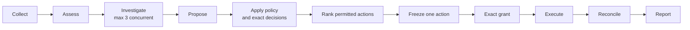
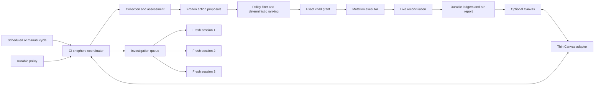

# CI Shepherd Autonomous Policy and Canvas Design

## Executive Summary

### High-level important points

- The CI shepherd's primary product is a headless, autonomous cycle that can
  operate with no Canvas open.
- Standing policy permits selected operation classes within per-run and rolling
  24-hour caps. It expires and can be paused or revoked.
- The report-first Canvas may change standing permissions and exact action
  decisions, then monitor their outcomes.
- The Canvas is an optional control surface, not an executor. The coordinator
  validates every request and remains the only component that calls GitHub.
- Every mutation still receives a short-lived grant bound to one frozen exact
  action.
- Read-only investigations run automatically through a rolling queue with at
  most three fresh sessions active at once.
- Closing or restarting the Canvas does not stop the run. Reopening rebuilds
  the view from durable coordinator state.

### Things that must not be missed

- Broad approval can cover future matching actions, but only within the
  selected repository, operation classes, caps, and expiry.
- "Allow all issue changes" is bounded. It never means unlimited writes,
  quarantine changes, pushes, or pull-request creation.
- A row-level rejection overrides broad policy. A row-level approval applies
  to one frozen action and does not silently broaden standing policy.
- Canvas controls may change permissions or an action's approval decision
  before execution. They may not rewrite a frozen action's target, operation,
  or rendered body.
- Once an action records an execution intent, permission changes cannot erase
  it. The coordinator must finish or reconcile that intent without replay.
- The Canvas SDK is experimental, so Canvas code stays isolated from the
  headless policy and execution engine.

### High-level flow



The Canvas may inspect or change policy and exact decisions at any point before
an action records its intent. Headless scheduled cycles use the same durable
policy without waiting for the Canvas.

### Core selection change

This design replaces the current mismatch-prone sequence:

```text
rank every proposal -> select an exact prefix -> discover permission mismatch
```

with policy-aware selection:

```text
classify proposals -> apply denials and authorized classes -> rank permitted
proposals -> freeze exact actions -> grant -> execute -> reconcile
```

The change preserves deterministic ordering and exact-action grants while
making both standing autonomous policy and one-time human choices expressible.

## Problem

The production comment pilot currently requires an authorization grant to name
exactly the ordered action IDs in `comment-selection.json`. The selector ranks
semantic purpose before operation type. An edit wins over a create only when
both actions belong to the same semantic class.

The live cycle collected on 2026-09-03 demonstrated the resulting UX problem.
The user authorized at most two `edit-comment` actions, but the selector's first
four candidates were higher-priority `create-comment` watch actions. No legal
comment budget from one through five produced an edit-only prefix, so the run
correctly failed closed without making a change.

The safety behavior was correct. The permission model was difficult to predict
and could not express the user's intent.

The design must also preserve the shepherd's autonomous goal. Requiring an open
Canvas or per-run interaction would turn the UI into a scheduler dependency
and prevent unattended cycles.

## Goals

- Run complete shepherd cycles headlessly under durable, explicit policy.
- Support exact one-time action approval and capped operation-class policy.
- Allow approved policy to cover current and later actions in the same cycle.
- Persist standing policy across scheduled cycles with expiry and rolling
  budgets.
- Keep every mutation bound to one frozen, validated exact action.
- Keep deterministic priority within the set policy permits.
- Run read-only investigations automatically with at most three fresh local
  sessions active concurrently.
- Let a closed or restarted Canvas reconnect without interrupting the run.
- Present total potential mutation exposure before policy is activated.
- Make policy mismatch, exhaustion, staleness, and reconciliation visible.
- Validate the headless coordinator independently from the Canvas.

## Non-Goals

- Moving collection, assessment, selection, execution, or reconciliation into
  the Canvas.
- Requiring the Canvas to remain open during a run.
- Treating a broad policy envelope as an executable GitHub grant.
- Supporting unlimited mutation budgets.
- Adding multi-user approval, remote policy synchronization, historical
  analytics, or a standalone dashboard service in the first version.
- Replacing repository-specific safety checks or proposal validation.
- Allowing the assessment model to choose executable actions.

## Design Principles

### Autonomy is primary

The coordinator must produce the same decisions and outcomes with no Canvas
installed. Scheduled operation reads durable policy and writes durable run
state. The Canvas is an optional client over those interfaces.

### Policy permits; exact grants execute

A policy can authorize categories of future work, but it never authorizes a
raw GitHub call. Each matching proposal is rendered and frozen first. The
coordinator then creates a short-lived child grant for that exact action,
records an intent, executes one fixed operation, and reconciles the result.

### The browser is untrusted

The Canvas may request a policy change or exact decision. It cannot assert
remaining budget, action eligibility, target state, or execution success. The
coordinator recomputes all of them.

### Safety state is durable

Policy revisions, budget consumption, exact decisions, intents, terminal
results, and investigation lifecycle events are persisted before the UI
reports them. Reopening a Canvas reconstructs state from those records.

## Architecture



### Headless coordinator

The coordinator owns:

- cycle collection and assessment;
- proposal validation and classification;
- policy matching and deterministic ranking;
- persisted per-run and rolling-budget consumption;
- exact grant creation and execution;
- stale-target checks and reconciliation;
- the three-slot investigation queue; and
- final reporting and retrospective artifacts.

It exposes typed query and command boundaries that work from both scheduled
operation and the Canvas adapter. The first implementation may use validated
files and deterministic CLI commands rather than introduce a service.

### Durable policy store

Standing policy lives under the existing private CI shepherd state root. It is
versioned, append-only for audit purposes, and selected by repository.

A policy revision contains:

- repository;
- enabled operation classes;
- per-run caps by operation class;
- rolling 24-hour caps by operation class;
- an absolute expiry;
- creation time and actor identity;
- the prior policy revision it replaces;
- optional deny rules for exact targets or action IDs; and
- a cryptographic identity over the canonical policy bytes.

Policy edits never rewrite prior revisions. Revocation appends a new revision
that disables future matching.

### Thin Canvas adapter

The Canvas adapter:

- serves layout A, the report-first approval console;
- reads coordinator-owned status and report projections;
- creates, activates, revises, pauses, and revokes policy through validated
  coordinator commands;
- approves, rejects, or clears exact action decisions before execution;
- streams or polls durable status changes; and
- contains no GitHub credentials or mutation implementation.

The Canvas SDK is experimental. Canvas-specific code must remain behind this
adapter so SDK changes cannot affect the headless coordinator or policy format.

The adapter binds only to loopback, uses an unguessable per-instance token,
restricts origins, and validates the foreground session and repository before
accepting a command.

## Policy Model

### Operation classes

The first policy surface supports:

- `create-comment`;
- `edit-comment`;
- `close-issue`;
- `delegate-copilot`; and
- `rerun-or-retry`.

Quarantine source mutation, pushes, pull-request creation, and other
repository-code changes retain their existing separate workflows and grants.
They do not inherit permission from these issue-operation classes.

### Default caps

The Canvas starts with useful but bounded suggested values:

| Operation class | Per run | Rolling 24 hours |
|---|---:|---:|
| Create comments | 10 | 30 |
| Edit comments | 10 | 30 |
| Close issues | 5 | 10 |
| Delegate to Copilot | 3 | 5 |
| Rerun or retry | 5 | 15 |

The user may lower or raise these values before activating a policy. Zero
disables the class. The UI never presents an unbounded option.

A repository-wide hard ceiling limits all policy revisions to 100 mutations
per run and 300 mutations in any rolling 24-hour window. An exact approval may
override a disabled or exhausted operation-class cap for one named action, but
it cannot exceed either hard ceiling.

A standing policy expires after 30 days by default. Expiry is editable but
cannot exceed 90 days without creating a new policy revision.

Selecting "allow all issue changes" enables every listed class with the shown
caps. It does not mean unlimited writes or permission to perform source
changes.

### Exact decisions

An exact decision applies to one frozen action ID:

- `approve-once` authorizes that action even when its operation class is not
  enabled by standing policy;
- `reject-once` prevents that action in the current cycle even when standing
  policy permits it;
- `clear` removes the draft exact decision before an intent exists; and
- no decision leaves the standing policy in control.

Exact decisions are bound to proposal bytes and expire with the proposal.
`reject-once` wins over every broad allow rule.

An exact approval does not silently expand standing policy. It carries an
explicit one-action budget and may override that class's standing cap for only
the named action. Its terminal result still increments the same per-class,
per-run, rolling, and repository-hard-ceiling counters used by autonomous
actions. Later automatic selection observes that consumption.

### Current and future actions

Standing policy is an envelope for actions not yet known when the policy is
activated. A later same-cycle or later-cycle proposal may match only when:

- its repository and operation class match;
- its deterministic eligibility checks pass;
- neither an exact rejection nor another suppression blocks it;
- both per-run and rolling budgets have capacity;
- the policy has not expired or been revoked; and
- its exact frozen action passes current live preflight.

The coordinator records the policy revision that licensed each child grant.
This makes future-action authorization attributable without pretending that
the earlier policy knew the later body.

Each child grant expires after at most 15 minutes and never later than its
proposal or licensing policy. Copying or recreating a grant does not reset
persisted budget consumption or terminal action identity.

## Policy-Aware Selection

The selector first builds the complete eligible proposal list and records the
same deterministic semantic priorities used today. It then applies:

1. exact rejections;
2. standing-policy operation filters;
3. remaining per-class and rolling budgets; and
4. exact approvals.

Automatic candidates are sorted by the committed semantic priority,
operation priority, issue number, and action ID. The selector scans that order
once, admits a candidate when its operation budget has capacity, and records an
explicit exhaustion reason when it skips a candidate. This keeps global
ordering deterministic while allowing one exhausted class to yield to the next
permitted class.

Exact approvals form a separate explicitly chosen set. They are ordered
deterministically for execution but do not require the user to approve every
higher-ranked action of a different operation class.

The selection artifact records:

- every eligible candidate;
- why each candidate was allowed, denied, exhausted, stale, or superseded;
- the policy revision or exact decision responsible;
- the ranked automatic set;
- the explicit exact set;
- remaining per-class and rolling budgets; and
- the complete maximum write exposure.

This makes an edit-only policy filter out create actions before the automatic
prefix is taken. The 2026-09-03 run would therefore surface the three
status-retirement edits instead of selecting two creates and failing later.

## Autonomous Operation

A scheduled run:

1. acquires the existing single-writer state lock;
2. collects and assesses evidence;
3. queues bounded read-only investigations;
4. admits at most three fresh investigation sessions at once;
5. starts queued investigations as active sessions complete;
6. regenerates proposals after recorded investigation results;
7. applies current durable policy and exact decisions;
8. creates and executes one exact child grant at a time;
9. reconciles every intent before starting another mutation;
10. seals the run and completes the retrospective; and
11. leaves blocked or unlicensed work visible for later policy review.

The existing per-cycle investigation request budget remains independent from
the three-session concurrency limit. A cycle may therefore start three
requests, then start remaining requests as slots become free, without treating
three as the cycle's total.

No Canvas connection is checked during these steps.

## Canvas Experience

### Layout A: report first

The selected layout places:

1. run health, collection completeness, proposal count, and current mutation
   exposure at the top;
2. broad operation-class toggles and editable caps next;
3. the ranked action table with per-row approve/reject overrides;
4. expandable exact body, evidence, expected result, and blockers;
5. the running, queued, completed, and blocked investigation counts; and
6. authorization, pause, revoke, and refresh controls.

The policy panel previews the actions made reachable by the current toggles.
It must warn before activation when a class permits no current action or when
all matching actions are blocked.

### Close, reopen, and reconnect

Closing the Canvas does not stop the chat session, coordinator, mutation
executor, or investigation queue. The Canvas provider receives an `onClose`
notification, but safety state remains in the coordinator.

Unsubmitted policy edits are autosaved as a non-authorizing draft. Reopening
any Canvas instance:

1. resolves the repository and active run;
2. loads the latest coordinator state revision;
3. restores the draft separately from active policy;
4. displays actions completed while the panel was closed; and
5. resumes live updates from the latest durable event.

The design does not depend on reusing the same Canvas `instanceId`.

If the foreground Copilot session is cleared, replaced, or exits, the
extension process may restart. Reopening still reconstructs state from the
coordinator. Expired grants require fresh approval. An intent without a
terminal result enters reconciliation and is never retried as a new mutation.

## Failure Handling

The run and Canvas expose these explicit states:

- `collecting`;
- `investigating`;
- `awaiting-policy`;
- `ready`;
- `executing`;
- `reconciling`;
- `completed`; and
- `blocked`.

Missing evidence, unavailable policy, stale state, or disconnected UI never
maps to `completed`.

Budget checks and consumption occur atomically under the coordinator's state
lock. The browser receives a state revision with each projection. Commands
that name an older revision fail with `stale-view` and return a refreshed
projection.

Revocation prevents new child grants. It cannot erase an already recorded
intent. Such an action completes or reconciles to a typed terminal result.

If the Canvas adapter is unavailable, headless operation continues. If the
coordinator is unavailable, the Canvas becomes read-only and clearly reports
that policy changes and actions cannot be accepted.

## Validation

### Regression fixture

Freeze the 2026-09-03 proposal and selection artifacts as a test fixture. Under
an edit-only policy, the policy-aware selector must surface the three
`edit-comment` status-retirement actions and no create actions. Reverting to
rank-before-filter behavior must make the test fail.

### Coordinator tests

Cover:

- operation classification and policy filtering;
- deterministic order after filtering;
- per-run and rolling per-class caps;
- policy expiry and append-only revocation;
- exact rejection precedence;
- exact one-time approval without standing-policy expansion;
- stale proposal and changed-body rejection;
- stale state-revision rejection;
- exact child-grant binding;
- replay prevention;
- crash-after-intent reconciliation;
- cap persistence across restart; and
- headless operation with no Canvas installed.

### Investigation scheduler tests

Use barrier-controlled workers to prove:

- no more than three fresh investigation sessions are active concurrently;
- the fourth request does not start before a slot is released;
- one completion starts exactly one queued request;
- two completions may start two queued requests;
- worker failure releases its slot after durable terminal recording; and
- restart reconstructs active and queued work without duplicate launches.

### GitHub-boundary integration tests

Run the coordinator against a recording fake that implements the required
GitHub reads and writes. Assert:

- zero writes occur without a matching child grant;
- every write uses the exact frozen target and body;
- exhausted, revoked, expired, stale, and replayed actions perform no write;
- current CI-label and ownership preflights still apply;
- a recorded intent is reconciled rather than repeated; and
- per-class and rolling counters match terminal mutation results.

### Canvas tests

Component and browser tests cover:

- layout A at supported panel widths;
- policy toggles and editable cap validation;
- maximum-write exposure math;
- exact row expansion and evidence display;
- exact rejection overriding broad allow;
- policy preview showing newly reachable actions;
- stale-view refresh;
- autosaved non-authorizing drafts;
- close and reopen state reconstruction;
- coordinator-unavailable read-only mode; and
- actions and investigations completing while the Canvas is closed.

### End-to-end acceptance

Before another production pilot:

1. run the targeted coordinator, scheduler, integration, and Canvas suites;
2. execute a complete fixture cycle with no Canvas process;
3. execute the same fixture with the Canvas and compare artifacts;
4. use browser automation to activate policy, override one action, close the
   panel, let work complete, reopen, and verify the durable result;
5. inspect all grants, intents, terminal rows, budgets, and reports;
6. run an action-free live cycle under the proposed standing policy; and
7. commission a fresh read-only safety audit of the preserved artifacts.

Only after those checks pass should a separately approved bounded production
pilot enable one mutation class.

## Rollout

### Phase 1: headless policy engine

Implement the durable policy schema, policy-aware selector, exact decisions,
budget accounting, child-grant binding, and three-slot investigation scheduler.
Prove the full cycle without a Canvas.

### Phase 2: Canvas control surface

Add layout A with report and status projections, draft policy editing, exact
approve/reject/clear decisions, policy previews, revision conflicts,
activation, pause, and revocation. Validate reconnect behavior and prove that
installing or removing the Canvas does not alter headless cycle decisions.

### Phase 3: autonomous shadow operation

Run scheduled cycles with standing policy in shadow mode. Compare would-execute
sets, cap accounting, and reconciliation across repeated cycles.

### Phase 4: bounded production promotion

Promote one operation class at a time after action-free evidence and an
independent audit. Preserve exact grants, live preflight, mutation ledgers, and
retrospective review for every production effect.

## Decisions

- Autonomy is the primary product; the Canvas is optional.
- Use layout A, the report-first approval console.
- Persist policy across runs with per-run caps, rolling 24-hour caps, and
  expiry.
- Allow exact one-time decisions and broad operation-class policy.
- Permit future matching actions only through exact child grants.
- Limit investigations to three concurrent fresh sessions, not three total.
- Reconnect from durable coordinator state rather than Canvas instance memory.
- Keep the Canvas adapter isolated because the SDK surface is experimental.
- Validate headless behavior before enabling Canvas-controlled mutation.
